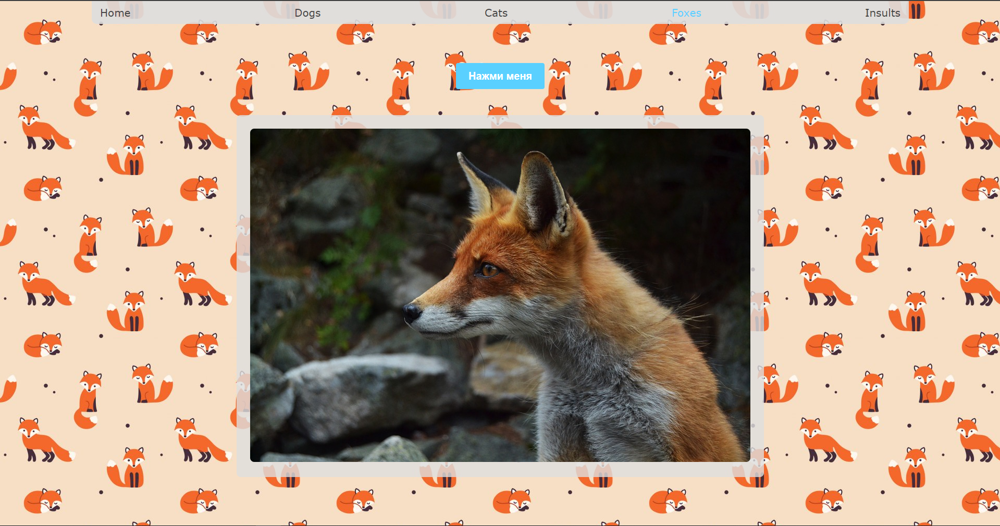

# randomAnimals
### Пет-проект.

Приложение для поиска забвыных картинок и гивок животных и не только...

На сайте есть несколько ссылок на получение случайных изображений или гивок животных, а так же ссылка Insults.

Чтобы узнать что на последней странице, перейдите на сайт [https://randomanimals1.com](https://randomanimals1.herokuapp.com) и узнаете сами :)

Стек:

    
